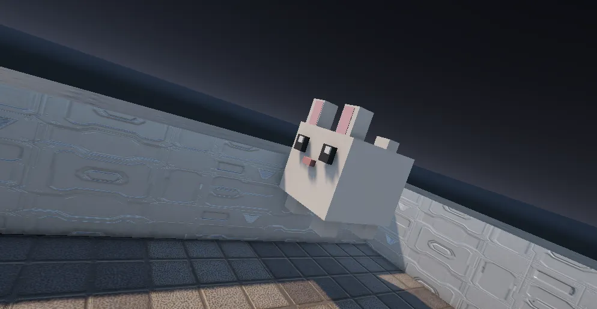

<h2> Project Name : M.O.N Protocol </h2>

  

<h1> Access to web </h1>

You can use the following link if you want to test or just enjoy the project: 
 

``https://mon-protocol.onrender.com/``

<h1>Build locally</h1>

Use ``npm install`` if you want to download all dependencies in Angular. If you want to see the page in localhost you need to run ``ng serve``. Once you are done and you finished building your changes you can export your project using ``ng build``, this command will generate a new folder inside your project.  

For Unity you just need to select the the folder you downloaded when you made git pull, and in Unity Manager make sure to select the folder and select the proper version of unity 

<h1> Description </h1>

The game is inside the levels component, inside the game you will need to register as a user or if you already have created a user you can read the instructions in the main page. You can compare scores with other users and define who can beat the game with more points and show your skills being in the top of the rakning.

There's also a secret inside the game, if you are curious enough you can find the secret and even play with specials characters...

# Deployment

To deploy the page we used the following free websites:  

``https://neon.com/``  
we used neon to deploy our data base to cloud.  

``https://render.com/``  
Render is our main service to deploy the whole web (backend and frontend) in the cloud.

<h1> Contributors </h1>

<table>
  <tr>
    <td align="center">
      <a href="https://github.com/Firulais215">
        
         
        <b>César Cordero</b>
      </a>
    </td>
    <td align="center">
      <a href="https://github.com/Marc-Borrell">
        
         
        <b>Marc Borrell</b>
      </a>
    </td>
  </tr>
</table>
